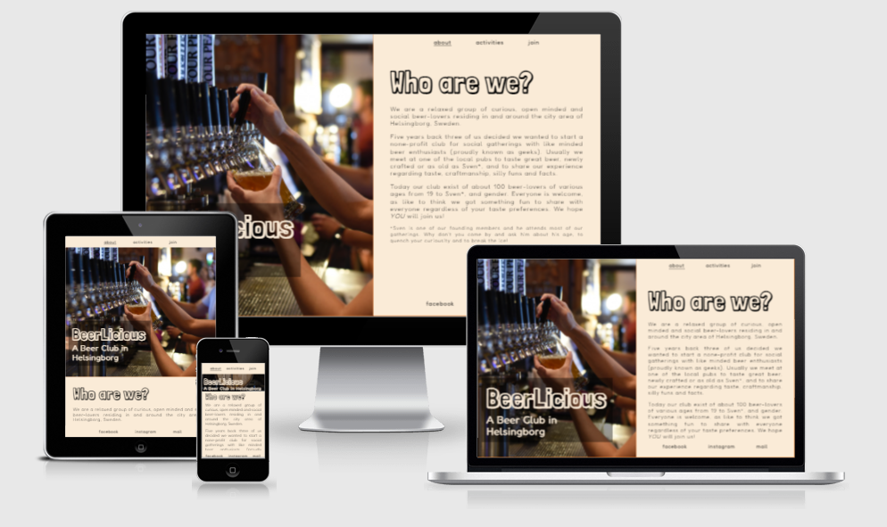
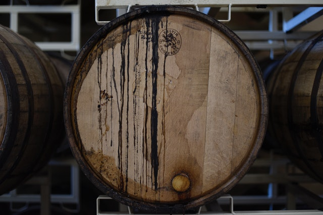
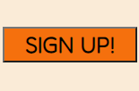
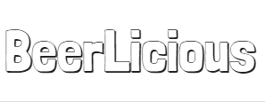
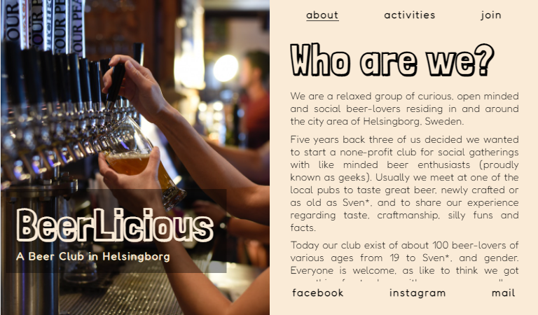
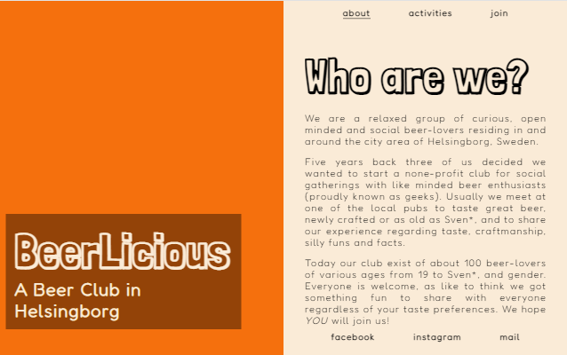
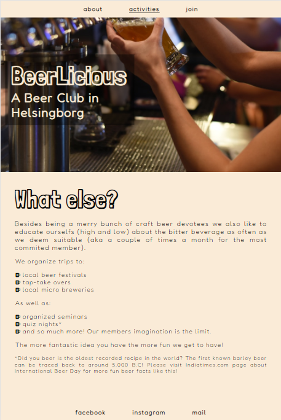
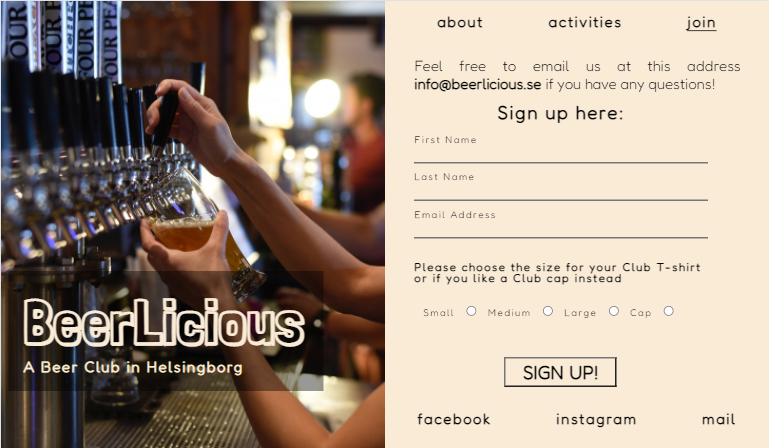
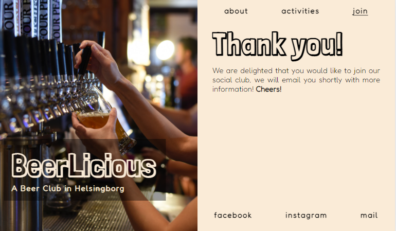

# **BeerLicious**

**BeerLicious** is the website for a fictive beer club located in the city of Helsingborg, Sweden. The club aim to encourage other beer interested people in the area to meet up and share social activities, learn from each other and just enjoy a relaxed gathering with like-minded beer lovers. This site targets various kinds of people whom are interested in knowing more about the different kinds of beer, the crafting procedure and know how of beer together, not the alcohol aspect of the brew. 

Let me introduce you further to [**BeerLicious**](https://monika-81.github.io/project1/).
<br>
<br>

<br>

---
## **Content**
1. [**Design**](#design)
    - [The layout](#the-layout)
    - [Hero Image](#hero-image)
    - [Color scheme](#color-scheme)
    - [Fonts](#fonts)

2. [**Features**](#features)
    - [Navigation bar](#navigation-bar)
    - [Hero Image](#hero-image)
    - [About page](#about-page)
    - [Activities page](#activities-page)
    - [Join page](#join-page)
    - [Confirmation page](#confirmation-page)
    - [External links](#external-links)

3. [**Technologies**](#technologies)

4. [**Testing**](#testing)
    
5. [**Deployment**](#deployment)

6. [**Credits**](#credits)
    - [Content](#content)
    - [Media](#media)
    - [Acknowledgement](#acknowledgement)

[Back to top](#beerlicious)

---

## **Design**

### **The layout**
The design choice for the BeerLicious main page for desktop aims to get the user to think about an open book or magazine, like looking at a "club brochure" through a screen. With a decorative image to the left to set the mode as well as visually inform the user what the site is about. For portrait oriented devises the image is instead set at the top to welcome the user.

- **Wireframes**
  Initially the design idea was sketched with pen and paper and thereafter transformed to basic wireframes for a clearer visual approached of the end result. The desktop version shows the main design goal of the split screen display. The split screen display was also added to the mobile screen in landscape position for a consistent design. For tablet format the mobile wireframe was slightly changed with a bigger hero image to welcome the user. But overall the main design idea was kept throughout the project.

 
<br>
<br>

### **Hero Image**
With the BeerLicious website I wanted the story of the site to start on the left-hand side with an image that visually informs the user of what sort of content to expect. The overall design of the picture needed to be a darker setting to contrast the lighter text block to the right of the screen. The idea was to combine the color nuances of the hero image with the color theme, so the larger picture contains a beer class with a color that was similar to the accent color idea of the project. Two different pictures was chosen for different screen alignment, one for desktop and landscape mode and one for smaller portrait mode devises. A smaller picture on a smaller screen also makes the site more responsive.

  
<br>
<br>

### **Color scheme**
The goal of the design is to keep a clean and consistent user experience throughout the pages. With a light background/dark text set up and one accent color that associates the user with beer. The color was picked from the hero image using Chrome DevTools color dropper tool, then adjusted slightly so the text would still be readable if the image won't load. A color palette was created with the help of [Colormind](http://www.colormind.io) to work as a design foundation during the project.

The color scheme below shows the color in hex-code but rgba was used in the css for consistency purpose.
<br>


<br>
<br>

The color inspiration from the main image:


<br>
<br>

The accent color can be seen while hovering over one of the links on the page, the email address or over the submit button:

  

<br>
<br>

### **Fonts**
The BeerLicious site want the user to get a taste of the lightheartedness and humor of the club. In line with that the fonts for the project was chosen to be playful. 
- The first font "Londrina Shadow" is used for the main titles. Both for the club logo and as a title for each page. 
- The second font "Fredoka" is the font used for the rest of the text content. But for the text underneath the BeerLicious club name as well as for all the article and list text.


<br>

<br>

[Back to top](#beerlicious)

---

## **Features**

### **Navigation bar**
At the top of the website there is an internal navigation bar that will help the user choose between the "about page" (home page), "activities page" and the "sign up page" - also know as "join". The current page the user is visiting is marked for easier navigation on the site. On desktop and landscape oriented screens the navigation bar is located to the top right side of the page, and on portrait oriented devices the navigation bar is fixed at the top of the screen.
<br>

 
<br>
<br>

### **Hero Image** 
As part of the main design there is a "hero image" to the left of the page at desktop and screens in lanscape position. The same image will transform as a header image at viewports the scale of 1200px down to 600px therafter a smaller image will serve as the hero image. The image main purpose is to set the mode and in itself get the user to associate the site with beer. Visually it will work as a complement to the text section but if the image won't load there is a background color in the accent color that connects to the color scheme of the entire web page. The logo "BeerLicious" that rest on top off the hero image acts both as an title to the entire page but also works as a internal link to the home page of the site. Giving the user the option to interact with the image text to take them back to the home page.   
<br>

    
<br>
<br>

### **About page**
The home page a.k.a. the "about page" gives the user a short introduction to the club, who they are and why they started the club. The information text is slightly humoristic to give a general feeling about the lightheartedness and humor of the gathering group while still being informative. The main design theme of the page was to make it easy to read, sleek in the design and yet introduce the user to the club and it's purpose. 
<br>


<br>
<br>

### **Activities page**
For more information on what sort of activities a potential new member of the club could come to expect from BeerLicious, the user finds a list of example activities on the activities page. To keep up with the tone set on the home page, there is a fun facts quote at the end of the page with an external link to [Indiatimes.com](https://www.indiatimes.com/trending/social-relevance/international-beer-day-facts-about-beer-546635.html) where the fact was borrowed. The link to the external page serves to credit the orignal writer of the article and to give the user the choice to read up on more fun facts. 
<br>


<br>
<br>

### **Join page**
The "join" page gives the user instructions on how to sign up for BeerLicious, the cost of membership and also informs the user that he or she will receive a club t-shirt or cap with the BeerLicious logo if the decide to join. The page includes the email address for any further questions and doesn't require the user to sign up first. The user can either click the link to open an external web client or copy the address and open their preferred email client to sent an email. The sign up form requires all fields to have the correct input before the form can be sent. When the user hover over the submit button, it changes color to the accent color of the design.
<br>

  
<br>
<br>

### **Confirmation page**
After the user have succesfully submitted the form the user is greeted with a confirmation page, informing the user that he or she will be contacted shortly. 
<br>


<br>
<br>

### **External Links**
At the bottom of the screen, the user finds the external navigation links to social media as well as to open a email client to send an email to the BeerLicios club directly. The position of the navigation bar at the bottom mimics the navigation bar at the top of the page. On desktop and landscape oriented screens the navigation bar is located to the bottom right side of the page, and on portrait oriented devices the navigation bar is fixed at the bottom of the screen.
<br>


<br>
<br>

[Back to top](#beerlicious)

---

## **Technologies**

### **Languages**

- **HTML5**
<br> I used HTML to create the base structure of the project. I started with a basic bolierplate set up and created the first crude structure of the page out of the original design. 

- **CSS3**
<br> The CSS was used to apply the custom styles to the HTML skeleton. In a seperate document the positioning and creation for the whole design come forth. 

### **Tools**

- [Balsamiq](https://balsamiq.com/)
    - I used Balsamiq to make the basic wireframes for this project.

- [BrowserStack](https://browserstack.com)
    - I used BrowserStack to test for browser compatibility.

- [Colormind](http://www.colormind.io)
    - I used Colormind to create a color palette for my color scheme.

- [DevTools](https://developer.chrome.com/docs/devtools/)
    -  I used DevTools to test both changes in my code as well as the responsibility of the site.  

- [Font Awesome](https://fontawesome.com)
    - I used Font Awesome for find the icon used on the site.

- [GitPod](https://www.gitpod.io/)
    - I used GitPod as the code editor for this project.

- [GitHub](https://github.com/)
    - I used GitHub to create a repository for my project and to deploy my site.

- [Google Fonts](https://fonts.google.com/)
    - I used Google Fonts to find the fonts used for the site.

- [Lambda Test](https://lambdatest.com)
    - I used Lamda Test to test for browser compatibility.

- [Responsive Design Checker](https://responsivedesignchecker.com)
    - I used Responsive Design Checker to test the responsibility of the site.

- [WAVE](https://wave.webaim.org/)
    - I used Responsive Design Checker to test the responsibility of the site.

- [W3Schools](https://www.w3schools.com/) 
    - I used W3C to test and validate my code throughout the project. 

<br>


[Back to top](#beerlicious)

---

## **Testing**

For more information about the testing performed during the development, go to the separate [testing](/TESTING.md) page.
<br>
<br>

[Back to top](#beerlicious)

---

## **Deployment**

The project was deployed to **GitHub** using **GitPod**:
- Go to the project's repository page at GitHub.
- Go to *settings* in the upper menu, and then choose *pages* in the left-hand menu.
- Under the Source section, select the *Main branch* from the drop-down menu and click Save.
- On top of the screen there will be a massage displayed with the active link.
<br>

A copy of this GitHub Repository can be made by either making a copy on your local machine or by forking the GitHub content. By using a copy of the repository, changes can be made to the copy without affecting the original code. To make a copy of the repository, follow these steps:

**Forking**
- Locate the repository at **GitHub**.
- At the top right-hand side is a button called *fork*, click on the button to create a copy of the original repository in your GitHub Account.
<br>

**Copy**
- Locate the repository at **GitHub**.
- At the top of the files menu, click the green *code* button.
- The first option in the scrolldown menu is clone, where you get three choices of how to clone the repository.
- To clone a copy to your GitHub Desktop, click **Open with GitHub Desktop**.
- By clicking "choose" you can pick where you want to store the clone on you local machine.
- And finally, click the button *clone*.
<br>
<br>

[Back to top](#beerlicious)

---

## **Credits**

### **Content**
- Fun fact quote underneath the activities list on page two was taken from an article about International Beer Day 2021 in [Indiatimes.com](https://www.indiatimes.com/trending/social-relevance/international-beer-day-facts-about-beer-546635.html).
- The color palette was created using [Colormind](http://www.colormind.io)
- The [Fredoka](https://fonts.google.com/specimen/Fredoka?query=fredok) and [Londrina Shadow](https://fonts.google.com/specimen/Londrina+Shadow?query=londrina) fonts come from [Google Fonts](https://fonts.google.com/).
<br>

I **consulted** following sites for help with code design:
- the [Font Awesome](https://fontawesome.com) website about how to mark font icons for better accessibility.

```aria-hidden="true"```
- Stack overflow for help to hide the horizontal [scrollbar](https://stackoverflow.com/questions/16670931/hide-scroll-bar-but-while-still-being-able-to-scroll); 

```::-webkit-scrollbar { display: none; }```

 - as well as how to change input color for my [radion buttons](https://stackoverflow.com/questions/4253920/how-do-i-change-the-color-of-radio-buttons) in the sign up form;

```input[type="radio"] { accent-color: rgba(0, 0, 0, 1); }```
- To tackle the autofill input color in the form I consulted [CSS-tricks.com](https://css-tricks.com/snippets/css/change-autocomplete-styles-webkit-browsers/);

```input:-webkit-autofill, input:-webkit-autofill:hover, input:-webkit-autofill:focus, textarea:-webkit-autofill, textarea:-webkit-autofill:hover, textarea:-webkit-autofill:focus, select:-webkit-autofill, select:-webkit-autofill:hover, select:-webkit-autofill:focus { -webkit-box-shadow: 0 0 0px 1000px rgba(250, 235, 215, 1) inset; transition: background-color 50000s ease-in-out 0s; }```

<br>
All three codes was tested through the live server in chrome before commited to style.css. 

<br>

### **Media**
- The hero images for both landscape and portrait orientation of the screen comes from the artist ELEVATE at [Pexels.com](https://www.pexels.com/sv-se/@elevate).
- The beer mug icon on the same page are from [Font Awesome](https://fontawesome.com/).
- The image at the top of this page, that shows how the website is presented on different media screens are a screenshot from [Am I responsive?](http://ami.responsivedesign.is/)

<br>

### **Acknowledgement**

- Nicklas Elling at Dataföreningen Stockholm for introducing me to Code Institute.
- My mentor Precious Ijege at Code Institute for valuable input and encouragement.
- The Slack community for be such an open, warm and charing place. 
- My friend and senior developer Alfred Skedebäck for the motivation and introduction to important basics as a future developer, even before my studies started. And for his input about best and general practice as well as hints about improvements for this project. 
- Viet Hoang for letting me run the page by him and for getting user experience input before, during and at the final stage of the project.


[Back to top](#beerlicious)

---

